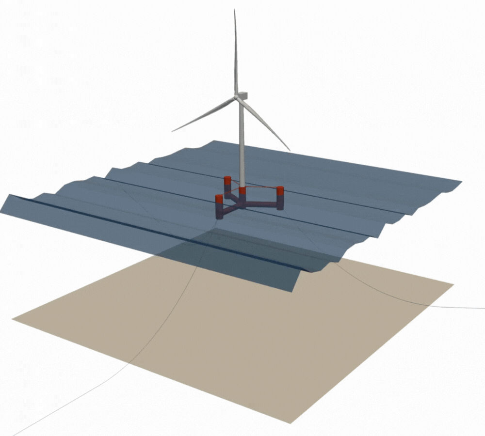
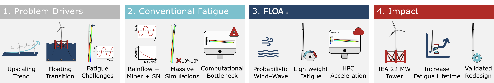
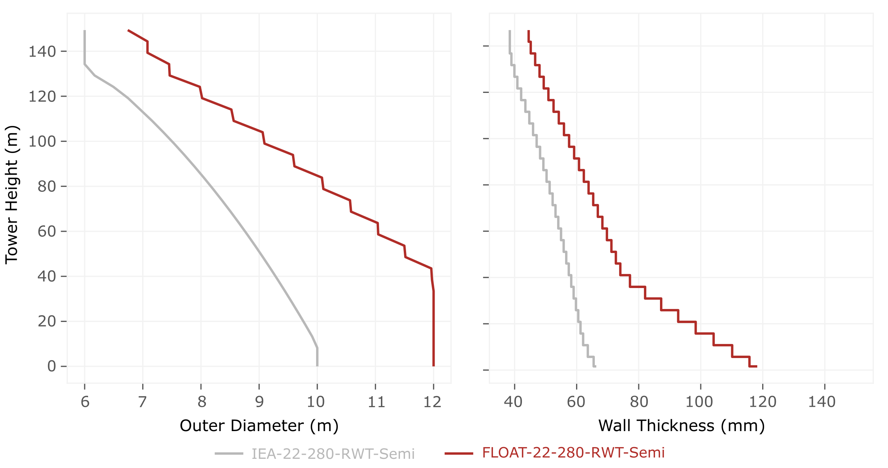
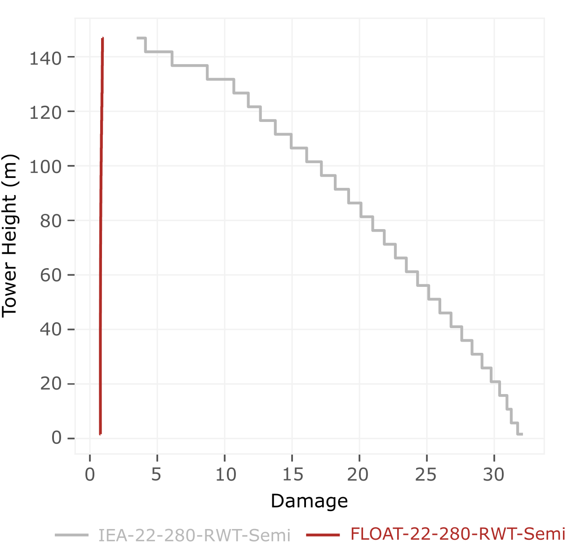

<p align="center">
  
</p>

# FLOAT-22-280-RWT-Semi
<p align="center">
  <a href="https://arxiv.org/abs/2601.01657">
    
  </a>
  <a href="https://joao97ribeiro.github.io/FLOAT/">
    
  </a>
  <a href="https://github.com/Joao97ribeiro/FLOAT">
    
  </a>
  <a href="https://www.apache.org/licenses/LICENSE-2.0">
    
  </a>
</p>

<p align="center"><strong>IEA 22 MW Semi model redesigned for fatigue.</strong></p>


The **IEA 22 MW Semi-submersible** is a key reference model for floating wind and reflects the industry’s upscaling trend toward larger rotors and taller towers. Its original release did not include a tower configuration evaluated under fatigue constraints.

This repository provides the first fatigue-oriented redesign of the IEA 22 MW floating tower, **FLOAT-22-280-RWT-Semi**, enabled entirely by [FLOAT](https://github.com/Joao97ribeiro/FLOAT), our lightweight fatigue-aware design optimization framework.

<p align="center">
  
</p>


### Authors: 
- **João Alves Ribeiro** (MIT & University of Porto) — [jpar@mit.edu](mailto:jpar@mit.edu)
- **Francisco Pimenta** (University of Porto)
- **Bruno Alves Ribeiro** (TU Delft & Brown University)
- **Sérgio M. O. Tavares** (University of Aveiro)
- **Faez Ahmed** (MIT) — [faez@mit.edu](mailto:faez@mit.edu)

---

<h3 align="center">⚠️ The FLOAT-22-280-RWT-Semi is being adopted by the official <a href="https://iea-wind.org/task55/">IEA Wind Task 55 REFWIND</a> reference turbine.</h3>

<p align="center">
  Track its integration into the <strong>IEA 22-MW offshore reference wind turbine</strong> in
  <a href="https://github.com/IEAWindSystems/IEA-22-280-RWT/pull/164">IEAWindSystems/IEA-22-280-RWT PR #164</a>.
</p>

---


## FLOAT Paper 

The **FLOAT-22-280-RWT-Semi** is documented in full detail in the scientific paper [**FLOAT: Fatigue-Aware Design Optimization of Floating Offshore Wind Turbine Towers**](https://arxiv.org/abs/2601.01657), where the tower, the optimization process, and the validation are presented.

<p align="center">
  
</p>


### Key Redesign Metrics
Using **FLOAT**, the [**IEA 22 MW**](https://github.com/IEAWindSystems/IEA-22-280-RWT) floating reference tower was redesigned under fatigue constraints, achieving:
- **Fatigue damage reduction:** at the tower base, damage decreases from 32.1 → 0.8 (**~98% reduction**); at the tower top, from 3.5 → 0.9 (**~73% reduction**)
- **Fatigue lifetime extension:** from **~9 months to 25 years** (**~33× increase**)
- **Geometry change:** tower base diameter increases from 10 m → 12 m, which raises the tower mass from 1,574 t to 2,656 t (**~69% increase**) to satisfy fatigue requirements
- **Validation:** redesign verified through **6,468 coupled wind–wave high-fidelity OpenFAST simulations**


### Geometry and Fatigue Response Comparison
The redesigned tower introduces a new geometric profile driven by fatigue requirements:
<p align="center">
  
</p>

The figure below shows how the fatigue damage distribution decreases when moving from the original **IEA-22-280-RWT-Semi** tower to the fatigue-optimized **FLOAT-22-280-RWT-Semi** design:
<p align="center">
  
</p>


## What This Repository Provides

This repository includes for the **FLOAT-22-280-RWT-Semi**:
- [OpenFAST](https://github.com/openfast) aeroelasic model inputs (OpenFAST version 3.5.2): see [OpenFAST](./OpenFAST).
- [WindIO](https://github.com/IEAWindSystems/windIO) turbine ontology file: see [WindIO](./WindIO).


## What FLOAT-22-280-RWT-Semi Adds to IEA-22-280-RWT-Semi

This repository introduces a new fatigue-oriented tower for the ***IEA-22-280-RWT-Semi** and updates the platform mass to remain dynamically consistent with the baseline model.
The following input files are modified:

- **FLOAT-22-280-RWT-Semi_ElastoDyn_tower.dat**: Updated tower properties (TMassDen, TwFAStif, TwSSStif) while retaining the original mode shapes.
- **FLOAT-22-280-RWT-Semi_ElastoDyn.dat**: Updated platform mass (PtfmMass) and adjusted it by subtracting the additional weight introduced by the new tower.
- **FLOAT-22-280-RWT-Semi.fst**: Updated OpenFAST primary file to reference the new tower and ElastoDyn inputs.

All remaining OpenFAST input files remain unchanged and follow the original model.


## Reproducing this Tower

From inside the [FLOAT repository](https://github.com/Joao97ribeiro/FLOAT):

```bash
python examples/08_float_paper_workflow/run.py
```

chains the reference analysis, the two optimization passes (`opt1` → `opt2`), the comparison plots, and the OpenFAST `.dat` export — re-generating exactly the tower bundled in this repository. All input files (geometry, modeling YAMLs with the precomputed high-fidelity damage, analysis YAMLs with constraints and design variables) ship in [`examples/input_files/float_paper/`](https://github.com/Joao97ribeiro/FLOAT/tree/float-stable/examples/input_files/float_paper).


## Documentation

The theoretical background and validation of the tower are fully presented in the [**FLOAT paper**](https://arxiv.org/abs/2601.01657). The framework itself, including the `pyfloat` Python package and the step-by-step example that reproduces this tower, lives in the [**FLOAT repository**](https://github.com/Joao97ribeiro/FLOAT) — see [`examples/08_float_paper_workflow/`](https://github.com/Joao97ribeiro/FLOAT/tree/float-stable/examples/08_float_paper_workflow) for the end-to-end runner.


## License

This project is licensed under the **Apache License 2.0**.  
See the [LICENSE](./LICENSE) file for full details or view it online at: [Apache License 2.0](https://www.apache.org/licenses/LICENSE-2.0).


## Citations

If you use **FLOAT-22-280-RWT-Semi** in your work, please cite:

> *FLOAT: Fatigue-Aware Design Optimization of Floating Offshore Wind Turbine Towers.*  
> João Alves Ribeiro, Francisco Pimenta, Bruno Alves Ribeiro, Sérgio M. O. Tavares, Faez Ahmed.  
> arXiv:2601.01657, 2026.  
> https://arxiv.org/abs/2601.01657

<details>
<summary>BibTeX</summary>

```bibtex
@misc{ribeiro2026floatfatigueawaredesignoptimization,
      title={FLOAT: Fatigue-Aware Design Optimization of Floating Offshore Wind Turbine Towers}, 
      author={João Alves Ribeiro and Francisco Pimenta and Bruno Alves Ribeiro and Sérgio M. O. Tavares and Faez Ahmed},
      year={2026},
      eprint={2601.01657},
      archivePrefix={arXiv},
      primaryClass={cs.CE},
      url={https://arxiv.org/abs/2601.01657}, 
}
```
</details>


## Maintenance & Support

For issues, questions, or feature requests related to **FLOAT-22-280-RWT-Semi**: [FLOAT-22-280-RWT-Semi Issues](https://github.com/Joao97ribeiro/FLOAT-22-280-RWT-Semi/issues).

## Acknowledgements
We thank [Garrett Barter](https://github.com/gbarter), [Pietro Bortolotti](https://github.com/ptrbortolotti), and [Daniel Zalkind](https://github.com/dzalkind) from the National Renewable Energy Laboratory (NREL) for their insightful discussions and technical guidance.

This project builds upon the [**IEA-22-280-RWT**](https://github.com/IEAWindSystems/IEA-22-280-RWT) reference wind turbine. We acknowledge the IEA Wind Task 55 REFWIND team for developing and openly releasing the foundational open-source model that enabled this work.
